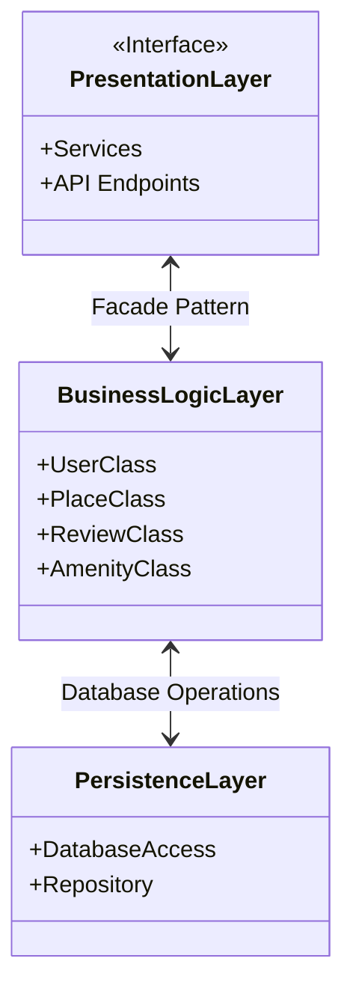

# High-Level Package Diagram

A high-level package diagram that illustrates the three-layer architecture of the HBnB application and the communication between these layers via the facade pattern. This diagram provides a conceptual overview of how the different components of the application are organized and how they interact with each other.

