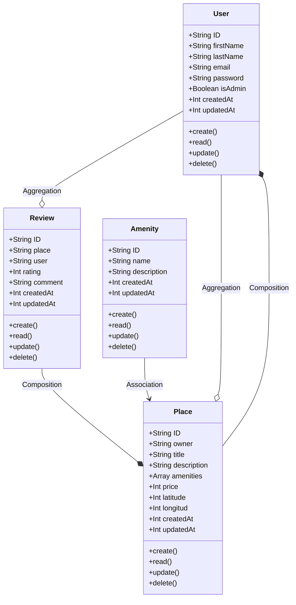

# Class Diagram for Business Logic Layer

A detailed class diagram for the Business Logic layer of the HBnB application. This diagram depicts the entities within this layer, their attributes, methods, and the relationships between them.

