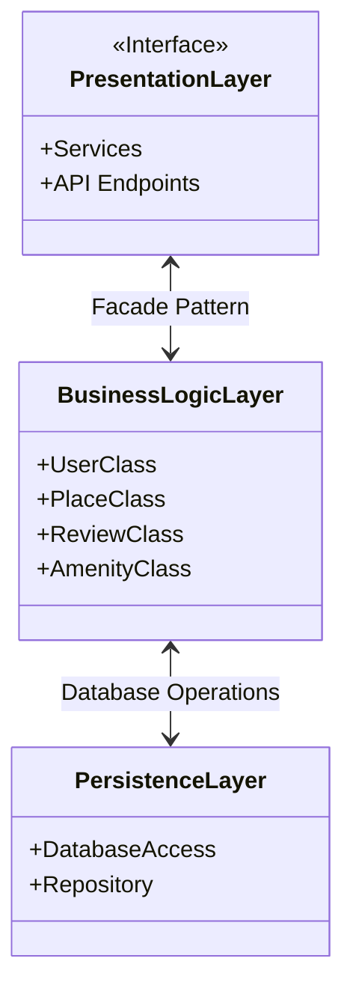

# High-Level Package Diagram

A high-level package diagram that illustrates the three-layer architecture of the HBnB application and the communication between these layers via the facade pattern. This diagram provides a conceptual overview of how the different components of the application are organized and how they interact with each other.

## Explanatory notes

### Presentation Layer
This includes the services and API through which users interact with the system

### Business Logic Layer
This layer contains the core business logic and the models that represent the entities in the system

### Persistence Layer
This layer is responsible for data storage and retrieval, interacting directly with the database

### The Facade Pattern
The Facade pattern provides a simplified interface to a complex subsystem, abstracting its complexity and providing a higher-level interface for clients
