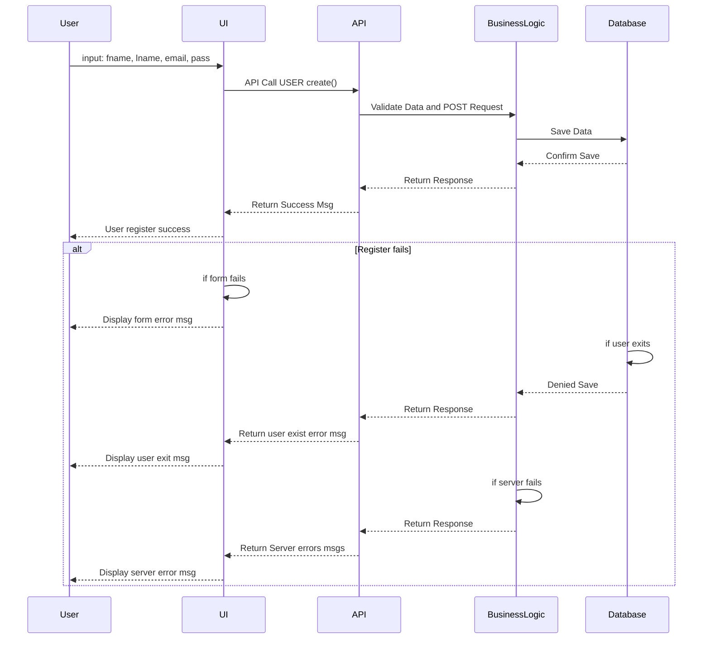
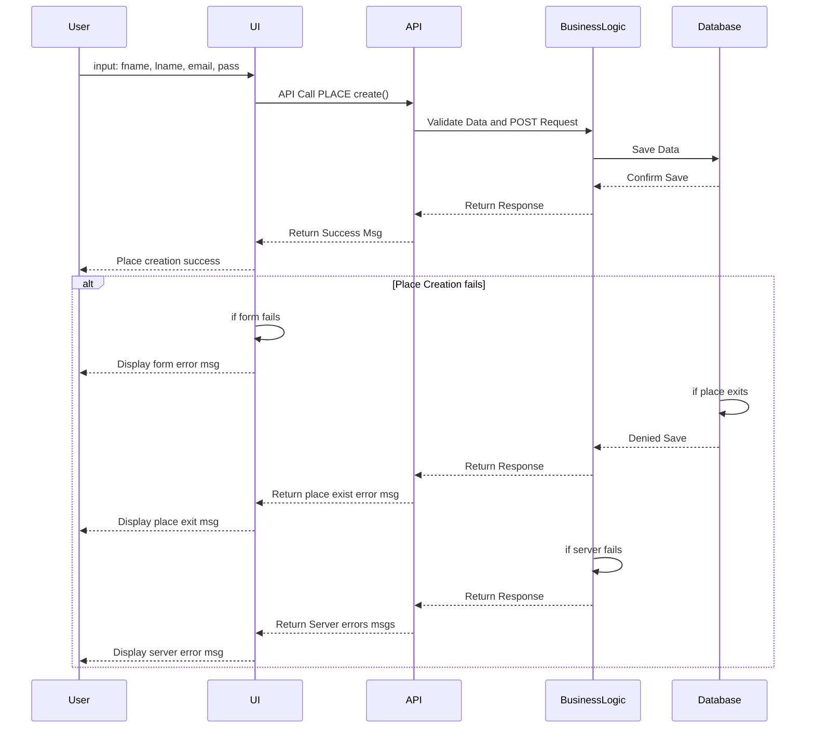
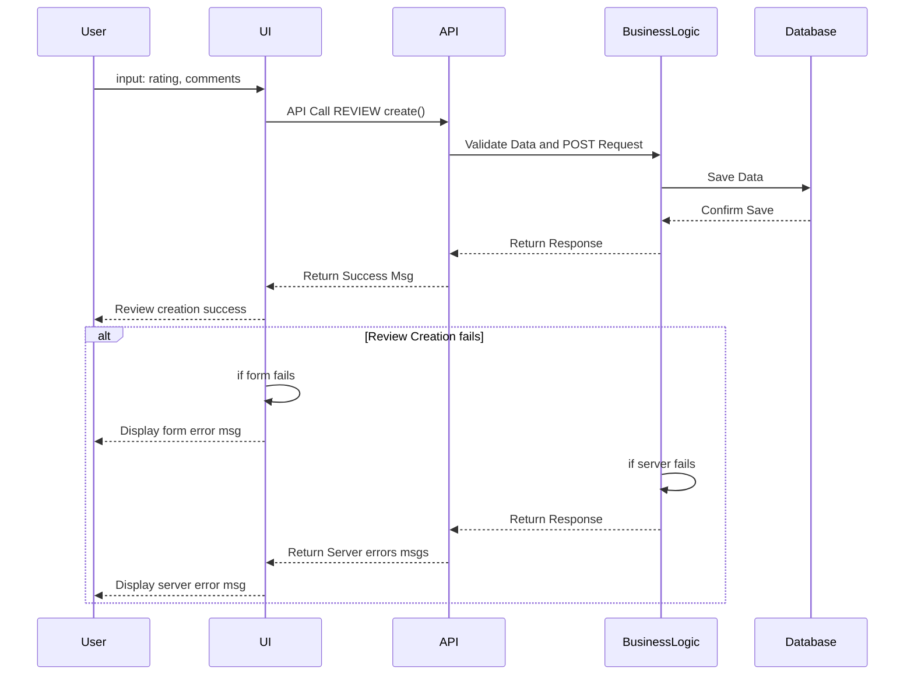
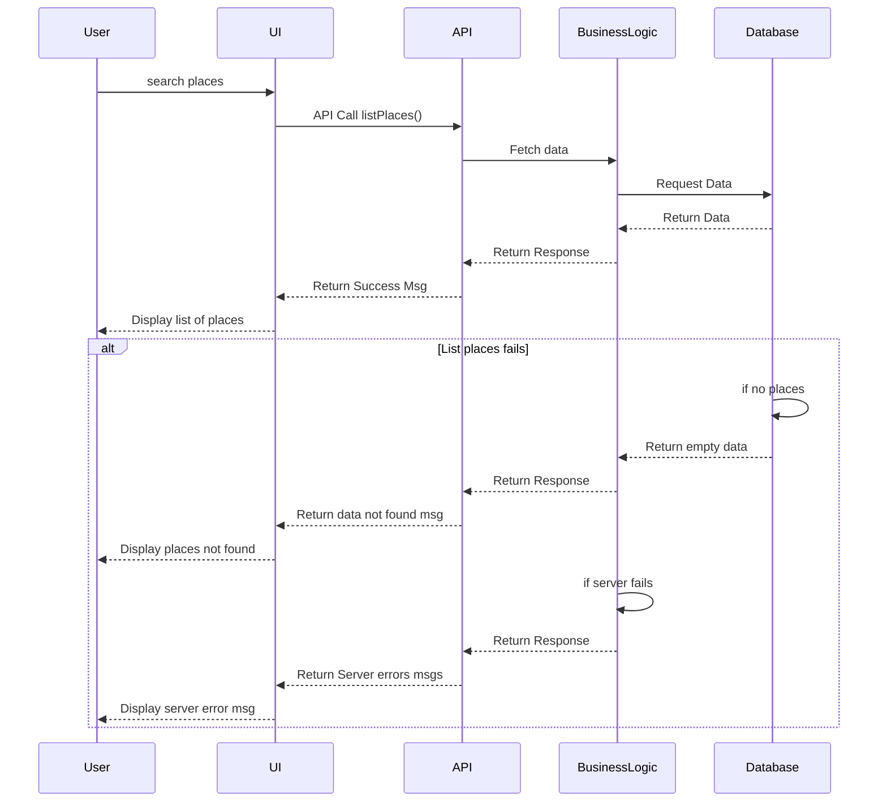

# Sequence Diagrams for API Calls

Sequence diagrams for some API calls to illustrate the interaction between the layers (Presentation, Business Logic, Persistence) and the flow of information within the HBnB application.

## User Registration

## Place Creation

## Review Submission

## Fetching a List of Places

